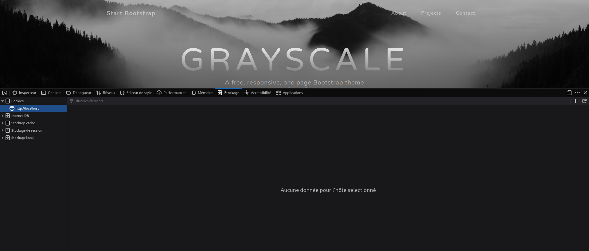
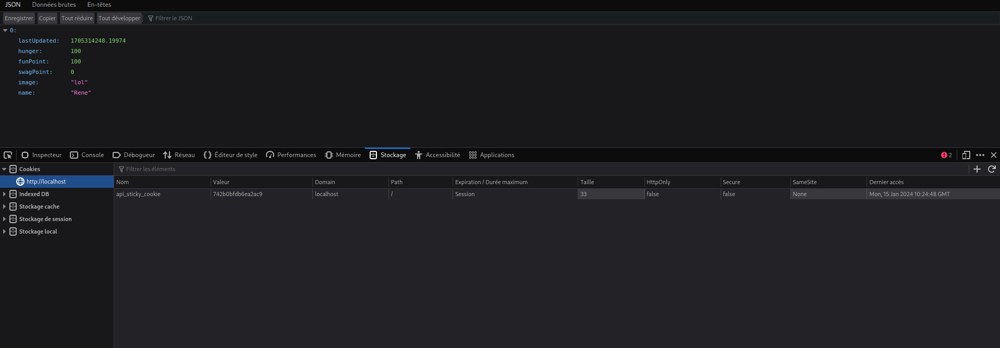
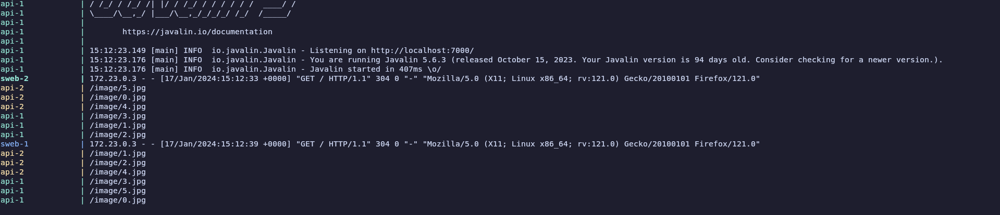
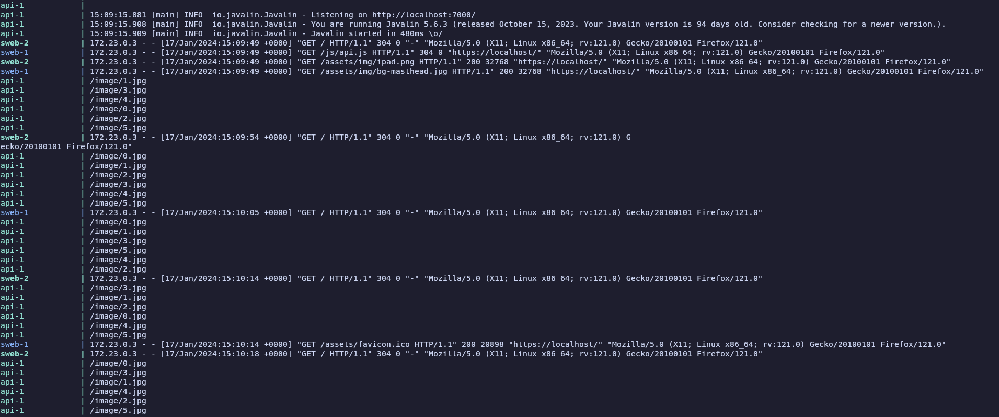
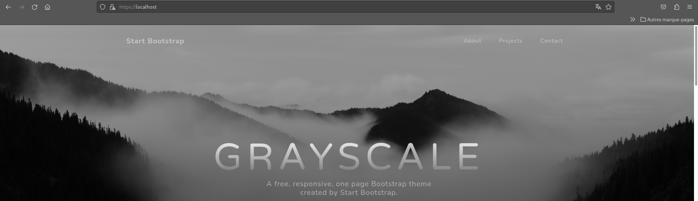
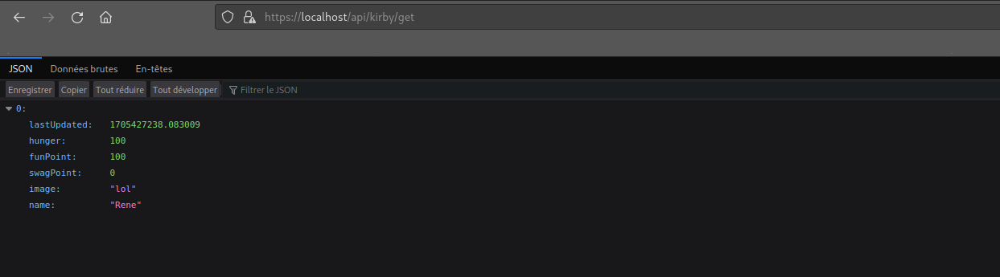
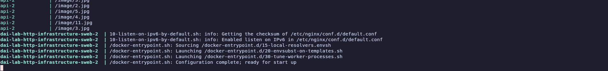

# Labo 5 HTTP Infrastructure

## Goal

Le but de ce laboratoire est de mettre en place une infrastructure web qui contient les points suivants:
- Mise en place d'un site web statique
- Deploiement du site web avec un docker compose
- Creation d'une api HTTP en Java
- Mise en place d'un reverse proxy avec Traefik
- Mise en place de load balancing pour la scability avec Traefik
- Mise en place du load balancing avec round-robin et sticky session
- Mise en place du chiffrement avec HTTPS

Dans ce rapport nous allons apporter des precisions sur les differentes etapes 

## Step 1

Le but de cette etape est de mettre un place un site statique avec Docker et Nginx.

Nous avons créé un dossier sweb avec la structure suivante. Le dossier www qui correspond au fichier html/css du site web, un Dockerfile ainsi qu'un nginx.conf.

Nous allons decrire nos fichiers de configuration de nginx ainsi que le Dockerfile

### Nginx.conf

Le fichier commence par `worker_processes 1` qui sert a specifier a nginx que nous voulons utiliser un processus pour gerer les requetes. Vu que le site est un simple site statique il nous semble pas utile de mettre plus de process.

La ligne `events {
    worker_connections 1024;
}
` sert a specifier le nombre de connection simultané. Vu que le labo sert a simuler une grosse architecture nous avons mis un nombre un peu grand.

Ensuite nous allons voir les 2 lignes suivantes : `listen 80` et `server_name localhost`. La premiere signifie que l'on ecoute le port 80. Ce port est utilisé par le protocole HTTP. La deuxieme serta specifier le hostname. Ce qui veut dire que ce serveur gerera toute les connections qui auront dans le champ `Host` de leur requete HTTP localhost.

Ensuite nous avons la regée 
```
location / {
            root /usr/share/nginx/html;
            index index.html;
        }
```
Cette configuration indique que pour les url / (qui correspond a root) qu'il faudra regarder les fichier dans le dossier mis apres `root`. Et que si aucun fichier n'est specifié qu'il serve le fichier mis apres l'option `index`.

Pour que cela fonctionne il faut aussi ajouter une regle qui permettront d'inclure les fichier css. Ceci peut etre fait avec la config suivante 
```
location ~ \.css$ {
            root /usr/share/nginx/html;
            types {
                text/css css; 
                }
        }
```
Cette regle s'applique a tout les fichiers qui finissent par .css et indique au serveur que le type des fichier est css. 

### Dockerfile

Le dockerfile est basé sur l'image publique nginx. 

Les 2 premieres lignes sont
```
COPY www /usr/share/nginx/html
COPY nginx.conf /etc/nginx/nginx.conf
```
Ces 2 lignes servent a prendre les fichier du coté machine (en premier les fichier du site et ensuite le fichier de config nginx).

Il les copie aux bons endroits du container docker.

Ensuite nous utilions la commnde `EXPOSE 80` pour exposer le port 80 hors du container et permettre a l'exterieur de lui addresser des requetes sur ce port.

Puis la derniere commande est `CMD ["nginx", "-g", "daemon off;"]` qui lance nging avec les options `-g` et `daemon:off`. Le flag `-g` qui permet de passer des options a nginx et `deamin:off` permet d'utiliser nginx pas en background qui est un good practice pour dans un container.

### Test

Pour tester si cette étape fonctionne il suffit de build l'image docker, lancer l'image puis de se rendre a l'addresse `localhost:80` et il devrait avoir le site statique qui s'affiche avec le css

## Step 2

Pour cette etape, nous devons simplifier le deploiement de notre simple application avec un docker compose. En outre, il doit etre possible de build notre Dockerfile via le docker compose

Pour ceci il faut créer un fichier compose.yaml

### Compose.yaml

Pour pouvoir dans un premier temps lancer l'application avec docker compose. Dans ce fichier nous declarons un service `sweb` qui utiliseras l'image du dossier sweb. Puis pour pouvoir le build il faudra ajouter la directive build comme ceci: 
``` yaml
version: '3'
services:

  sweb:
    build:
      context: ./sweb
      dockerfile: Dockerfile
    volumes:
      - ./sweb/www:/usr/share/nginx/html
```
La ligne version indique la version de docker compose qu'on utilise et la ligne services indique le debut de la section ou on va déclarer nos services.
La section build permet de construire notre service. context indique ou se trouve le repertoire avec les fichiers sources nécessaire à la construction du service et dockerfile indique le nom du fichier Dockerfile
La section volumes indique ou le contenue du repertoire ."/sweb/www" doit être monté dans le conteneur. Ici, il va être monté dans le répertoire "/usr/share/nginx/html"

## Step 3

Pour la partie realisation de l'api nous avons decidé de simuler un elevage de Kirby. Chaque kirby disposera d'une image aleatoire et d'un nom ainsi que divers statistique. Nous pouvons créer, lire, mettre a jour les statistique et detruire les kirby.
Pour l'implementation nous avons utilisé la librairie Javalin comme vu dans le cours. Il n'y a pas de grande revoultion dans l'implementation hormis le fait que les statistique evoluent dans le temps des kirby.

## Step 4
Dans cette partie nous allons mettre en place le reverse-proxy. Pour cela, nosu allons utilisé Traefik

``` yaml
version: '3'
services:

  sweb:
    build:
      context: ./sweb
      dockerfile: Dockerfile
    volumes:
      - ./sweb/www:/usr/share/nginx/html
    deploy:
      replicas: 1
    labels:
      - "traefik.enable=true"
      - "traefik.http.routers.sweb.rule=Host(`localhost`)"

  api:
    build:
      context: ./api
      dockerfile: Dockerfile
    deploy:
      replicas: 1
    labels:
      - "traefik.enable=true"
      - "traefik.http.routers.api.rule=Host(`localhost`)"
      - "traefik.http.services.api.loadbalancer.server.port=7000"
      - "traefik.http.routers.api.rule=PathPrefix(`/api`)"
       # Stripper
      - "traefik.http.routers.api.middlewares=api-strip"
      - "traefik.http.middlewares.api-strip.stripprefix.prefixes=/api"

  reverse-proxy:
    image: traefik:v2.10
    command:
     - "--api.insecure=true"
     - "--providers.docker"
     - "--entrypoints.web.address=:80"
    ports:
      - "80:80"
      - "8080:8080"
    volumes:
      - /var/run/docker.sock:/var/run/docker.sock
```
Dans cette étape deux nouvelles sections ont été rajoutée. reverse-proxy et api. La premiere est simplement une config de base qu'on trouve sur le site de traefik à laquelle on a rajouté une entrypoints sur le port 80 pour que Traefik puisse écouté ce port.

Les lignes avant ne sont pas très interessante. On va expliquer les lignes qui conserne Traefik. 
```yaml
  api:
    labels:
      - "traefik.enable=true" # Active Traefik pour ce service
      - "traefik.http.routers.api.rule=Host(`localhost`)" # Règle indiquant ou le service doit être accessible
      - "traefik.http.services.api.loadbalancer.server.port=7000" # Indique sur quel port l'api est exposé
      - "traefik.http.routers.api.rule=PathPrefix(`/api`)" #Règle de routage supplémentaire qui indique le chemain             pour accéder à l'api
       # Stripper
      - "traefik.http.routers.api.middlewares=api-strip"
      - "traefik.http.middlewares.api-strip.stripprefix.prefixes=/api"
```
Les deux dernieres lignes indique qu'on utilise un middleware stripper qui permet d'enlevé le prefixe /api avant de communiquer avec le service réel.

``` yaml
sweb:
    deploy:
      replicas: 1
    labels:
      - "traefik.enable=true"
      - "traefik.http.routers.sweb.rule=Host(`localhost`)"
```
Cette partie à été rajouté en plus de la configuration de base. La section deploy replicas indique combien de service on veut deployer

La sections labels est utilisé par traefik. La premiere ligne indique qu'on active traefik pour le service sweb et la seconde ligne définit une règle qui indique que le service doit être accessible via localhost.

Le reverse-proxy nous permet de sécuriser les accès à nos services, car le client n'interagit pas directement avec les serveurs. Ce dernier passer qu'a travers les routes qu'on a crée et le entrypoint qu'on a configuré.

Pour accèder au dashboard, il suffie d'aller sur http://localhost:8080/dashboard/#/

## Step 5

Pour demarrer plusieurs instances d'un service, on utilise la section replicas dans le docker compose
Pour ajouter ou enlever dynamiquement, on utilise la commande :
    docker-compose up --scale sweb=4 --scale api=3 -d

## Step 6

Pour utiliser les sticky session pour l'api on rajoute :
``` yaml
      - "traefik.http.services.api.loadBalancer.sticky.cookie=true"
      - "traefik.http.services.api.loadBalancer.sticky.cookie.name=api_sticky_cookie"
```
La premiere ligne indique qu'on active la fonctionnalité de "sticky sessions" pour le service. 
La seconde spécifie le nom du cookie.

On peut voir sur cette image que quand on arrive sur le site statique, on ne recoit pas de cookie. 



Alors que pour l'api, on a un cookie qui se nomme api_sticky_cookie




On peut le voir mieux avec les logs :

Ici, nous avons la config en round robin pour le site web statique et l'api. Comme on peut le voir sweb-2 est appelé la première fois qu'on va sut le site, puis si on recharge la page c'est sweb-1 qui est appelé. La même chose pour l'api, la moitié des images sont chargé depuis api-1 et l'autre moitié depuis api-2.


Une fois les sticky session activées, on peut voir que toutes les images viennent de l'api-1.


## Step 7

Pour commencer, on a modifié le fichier compose.yml. On a rajouté les lignes : 
```yaml
- "traefik.http.routers.sweb.tls=true" # Partie statique
- "traefik.http.routers.api.tls=true" # Partie api
- - "--entrypoints.websecure.address=:443" # Partie Traefik
```
Les deux premieres lignes permettent d'activé HTTPS pour ces services. La dernieres definit un point d'entrée sur le port 433 qui correspond au port pour HTTPS. 

Par ailleures, on a aussi monté les certificats et le fichier de config dans le conteneur Traefik

```yaml
    - ./certificat:/etc/traefik/certificates
    - ./traefik.yml:/etc/traefik/traefik.yaml
```


Ensuite, on a rajouté le fichier de configuration traefik.yml qui correspond au parametre fournit sur le site de traefik :

```yaml
providers:
  docker: {}

entryPoints:
  web:
    address: ":80"

  websecure:
    address: ":443"

tls:
  certificates:
    - certFile: /certificat/cert.pem
      keyFile: /certificat/key.pem

api:
  dashboard: true
  insecure: true
```
On peut voir qu'on arrive à acceder aux sites à travers https





## Optinal step 1

Nous avons décidé d'utiliser portainer pour réaliser cette étape. Pour accéder au dashboard, il faut aller à l'adresse :

https://localhost:9443/#!/home

et se connecter avec le compte admin et le mot de passe adminadmin12.

Pour implementer portainer, on a rajouté ces lignes dans le fichier compose.yml :

```yaml
  portainer:
    image: portainer/portainer-ce:latest
    ports:
      - 9443:9443
    volumes:
      - /var/run/docker.sock:/var/run/docker.sock
    restart: unless-stopped
```

Pour ajouter un nouveau conteneur, il faut cliquer sur local > Containers > cliqué sur le conteneur à dupliquer > cliquer sur Duplicate/Edit. A partir de là, il faut juste incrementer le chiffre à la fin du nom du conteneur et decocher always pull the image.

On peut voir sur l'image qu'un nouveau conteneur à été démarrer pour l'instance static :




## Optional step 2

Pour cette etape nous allons reprendre le site d'exemple que nous avons utilisé pour l'etape une et nous allons la rendre dynamique avec l'api fetch.
Pour ce faire nous avons créé un nouveau fichier js. Etant donné que nous detestons la syntaxe `Promise` de javascript et que cela n'avait pas d'interet de l'utiliser
nous allons utiliser le mot clé `await` de javascript. Ce qui implique que nos fonctions devront etre declarée comme asynchrone avec le mot clé `async`.
Mais nous ne pouvons pas l'utiliser en top level. Pour que nous puissions le faire nous devons dire que notre fichier est de type `module`.
Mais en faisant cela nous devons configurer notre serveur nginx pour lui dire que nous acceptons des fichier de format js. Pour ce faire nous allons ajouter
la regle suivante dans le `nginx.conf`
```
location ~ \.js$ {
            root /usr/share/nginx/html;
            types {
                application/javascript js;
                }
        }
```
Nous faisons 3 requete differente. 2 get et un post. Une requete pour obtenir tous les kirby, et une requete par kirby pour recuperer leur image ainsi qu'une requete pour créer son propre Kirby.
Pour la requete je me contente de faire un fetch sur l'endpoint de l'api qui me permet de recuperer tous les kirby. Puis pour chaque kirby je refais une requete pour recevoir l'image associée au Kirby.

En outre nous utilisons un petit formulaire qui permet de créer un kirby en lui precisant son nom
